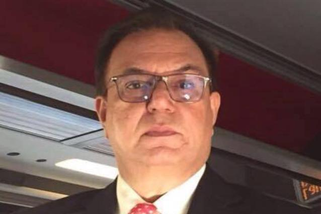

# Sardar Shaukat Ali Kashmiri
## Exiled Chairman of United Kashmir Peoples National Party (UKPNP)

The great leadership who is struggling for the rights of the People’s of the former princely state of Jammu & Kashmir. He is living in exile in Switzerland since April 25, 1999 after his life was in danger at the hands of ISI of Pakistan Army. Since 2002, he is Secretary General of International Kashmir Alliance (IKA), which is comprised of secular political parties struggling for the independence of Kashmir, Gilgit & Baltistan.
He was born on May 24, 1958 in a village called Papanar near Trarkhal, Sudhnuti, ‘Azad’ Kashmir. After completed early education from Government High School, Trarkhal in 1973, he moved to Karachi where he completed his F.Sc. In 1977 from Government Science College, Nazimabad, Karachi, and then B.Sc. in 1980 and then Bachelor of Laws in 1982 and Master of Islamiat in 1985 from Karachi University, Pakistan.
During student career at Karachi, he struggled for the educational and democratic rights of the students and organised many demonstrations and strikes in order to put administration’s attention on the matters. He was several times in jail in Pakistan and Pakistani occupied Kashmir.
During the period from 1985 to 1997 he practiced as an advocate in different courts of ‘Azad’ Kashmir. He is member of many NGOs and was once elected as general secretary of Bar Association Rawalakot. He was Secretary General of Sudhan Educational Conference, the oldest and biggest welfare organization. During the period from 1980 to 1997 he organised seminars in different cities of ‘Azad’ Kashmir on human rights violations and right of self-determination of the people of Kashmir, Gilgit & Baltistan and demanded the exit of Pakistan Army from POK.
He organised many demonstrations against Theo-fascism and Pakistan’s proxy war with India. In 1993, he represented Kashmiri people in the European Parliament Round Table Conference held in Brussels, in Belgium
Due to his strong and effective campaigns and increasing fame in the public, which was becoming a big threat to the puppet Government officials and other ISI bless parties for the future; He was abducted by ISI in 1994 and 1998. UKPNP and other like-minded parties and nationalist groups demonstrated against his illegal confinement and detention throughout ‘Azad’ Kashmir and Pakistan. In start ISI and Government of POK denied any involvement in his abduction, but because of continue pressure from the public and international community; he was released without charge after 9 months of illegal arrest.In 1994, he became the founding Chairman of United Kashmir People’s National Party.
During the period from 1999 to 2016 he delivered speeches during the sessions of UNHRC and Sub Commission on Human Rights in Geneva, on the subject of human rights violations and the Kashmiri’s right to self-determination for the establishment of United States of Kashmir On represented UKPNP in different international forums. 
Amnesty International declared him a prisoner of conscience when he was abducted by ISI in 1994 and 1998. 
He is living in exile in Switzerland since April 25, 1999 after his life was in danger at the hands of Inter-Services Intelligence (ISI) of Pakistan Army.
He is Secretary General ofJammu & Kashmir International People's Alliance (JKIPA), which is comprised of secular political parties struggling for the independence of Kashmir, Gilgit & Baltistan.
From 2002 to date, he has organised many conferences in different capitals of European countries.
By collecting all political parties of Jammu and Kashmir he has done Lobbying in favour of , Baroness Emma Nicholson's"Report on Kashmir: Present Situation and Future Prospects" which was under debate and discussion in 2007 at European Parliament Belgium ,Brussels . 
The only Kashmiri Nationalist Leader Exiled Chaiman UKPNP ,Sardar Shaukat Ali Kashmiri along with UKPNP delegation was present at the historical moment for the whole Kashmiri Nation where the "Report on Kashmir: Present Situation and Future Prospects" was passed by an overwhelming majority in the European Parliament in Strasbourg on 24 May 2007.
Indeed the European Union Policy on Kashmir and its Resolutions were historic significance for the oppressed Kashmiris which is a milestone for the Unification of Whole Jammu and Kashmir.